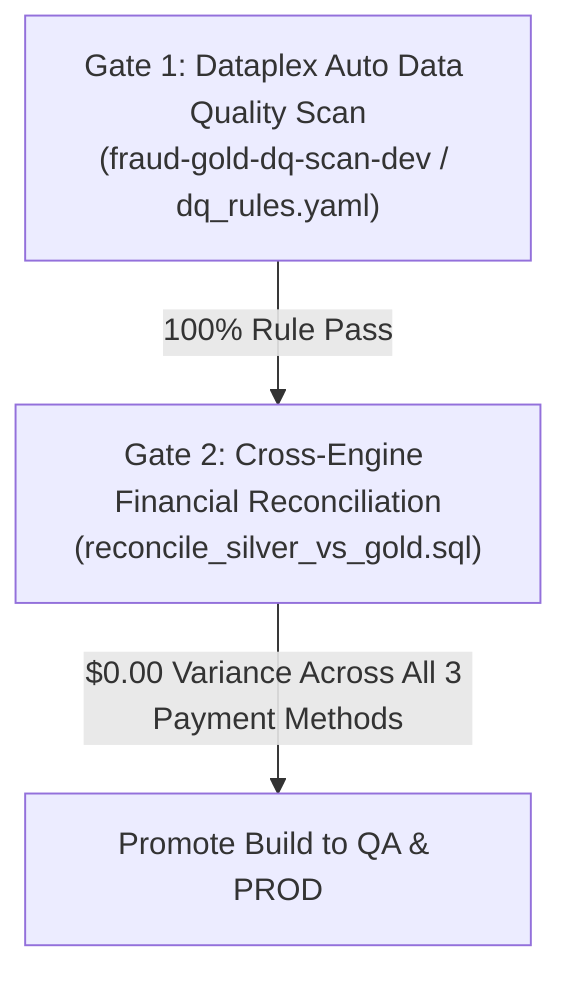

# Product Requirements Document (PRD)
## ACME Global Payment Fraud Lakehouse (Dev Environment)

**Document Version:** 1.1.0  
**Status:** Approved for Implementation (Step 02 of 10-Stage Agentic DE Lifecycle)  
**Authors:** Devon Patel (Lead Data Architect), Sonia Chen (Head of Governance), Marcus Vance (VP Platform), Google Cloud CE Team  
**GCP Target Project:** `acme-l400-part3-eri-01` | **Primary Region:** `us-central1`  
**Execution Runtime:** Managed Dataproc Serverless Spark 2.3 Premium Tier (Lightning Engine), BigQuery Native (`dbt-bigquery`), and Cloud Composer 3  

---

## 1. Executive Summary & Business Context

### 1.1 Business Objective
ACME Inc. operates a global payment network processing over 45,000 credit card authorizations per minute. Following the successful remediation of batch estates in Part 2 (achieving a 62.3% compute reduction via Lightning Engine), ACME's 3-person Fraud Prevention engineering squad requires a standardized, repeatable blueprint for developing net-new Medallion pipelines on Google Cloud Platform. 

The primary business goal is to build an enterprise-grade, fraud-detection Medallion Lakehouse in development (`dev`), serving curated behavioral features to the **Gemini Enterprise Agent Platform** and **Looker** dashboards with zero static service account keys, strict PII access controls, and zero fan-out financial reconciliation.

### 1.2 Multi-Engine Technology Division
*   **Bronze & Silver Layers (PySpark on Dataproc Serverless):** Heavy ingestion, schema enforcement, regex sanitization, multi-format timestamp parsing, and windowed deduplication executed on Managed Dataproc Serverless Spark 2.3 with Lightning Engine (`spark.dataproc.engine=lightningEngine`).
*   **Gold Feature Store Layer (SQL on BigQuery via dbt):** Curated feature mart aggregation, complex cross-table joins, and dimensional modeling executed natively in BigQuery using `dbt-bigquery`.
*   **Orchestration Layer (Cloud Composer 3):** End-to-end automated hourly pipeline execution with retries and OpenLineage tracking.

### 1.3 FinOps & Environment Governance
*   All pipelines, dbt models, and Cloud Composer DAGs parameterized with `--env=dev` (`ENV = os.environ.get('ENV', 'dev')`).
*   All infrastructure resources, catalogs, and datasets suffixed with `_dev` or `-dev`.
*   Mandatory GCP resource billing labels:
    ```yaml
    env: dev
    cost_center: fraud_prevention
    workload: fraud_lakehouse
    ```
*   Dataproc Serverless benchmark cohort: `spark.dataproc.cohort=fraud_benchmark`.
*   Knowledge Catalog governance aspect metadata: `lifecycle_env='DEV'`.

---

## 2. Ingestion Topology & Storage Architecture

### 2.1 Raw Landing Zone (`gs://${PROJECT_ID}-raw-landing/v0.01/`)
The landing bucket receives 5 raw feeds covering the period March 25–27, 2026, totaling **15,506,500 raw records** across 49 files (6.49 GiB):

1.  **Domain Master Snapshots (Daily Full Snapshot as of `snapshot_date=2026-03-27`):**
    *   `customers_crm`: CRM customer profiles, JSON Lines format (5 files: `customers_part_00.jsonl` to `_04.jsonl`), **510,000 rows**.
    *   `merchants_stores`: Merchant store directories, CSV format (2 files: `merchants_part_00.csv`, `_01.csv`), **26,000 rows**. Must be ingested with `header=true`, `multiLine=true`, and `escape="\""` to safely preserve 1,276 records containing embedded `\r\n` characters in `region_notes`.
2.  **High-Velocity Event Streams (Daily `year=2026/month=03/day={25,26,27}` Partitions):**
    *   `device_auth_logs`: Device authentication and login events, JSON Lines (12 files, 4/day), **4,120,000 rows** (`day=25`: 1,153,600; `day=26`: 1,400,800; `day=27`: 1,565,600).
    *   `payment_transactions`: Gateway payment authorizations, JSON Lines (24 files, 8/day), **10,490,000 rows** (`day=25`: 2,937,200; `day=26`: 3,566,600; `day=27`: 3,986,200).
    *   `chargeback_disputes`: Post-authorization dispute filings, JSON Lines (6 files, 2/day), **360,500 rows** (`day=25`: 72,100; `day=26`: 126,175; `day=27`: 162,225).

*Note: Folder date partitions reflect source event business timestamps at the gateway, NOT pipeline ingestion times.*

### 2.2 Tier-Isolated Catalog & Warehouse Structure
To prevent accidental queries against uncleaned raw data and eliminate privilege leakage, Bronze and Silver catalogs are physically and logically segregated:

*   **Bronze Catalog:** `acme_bronze_dev`  
    *   URI: `bl://projects/${PROJECT_ID}/catalogs/acme_bronze_dev`
    *   Warehouse GCS Root: `gs://${PROJECT_ID}-lakehouse-warehouse/bronze_dev/warehouse`
    *   Target BigQuery Dataset: `fraud_detection_db`
    *   Tables (5): `customers_crm_bronze`, `merchants_stores_bronze`, `device_auth_logs_bronze`, `payment_transactions_bronze`, `chargeback_disputes_bronze`
*   **Silver Catalog:** `acme_silver_dev`  
    *   URI: `bl://projects/${PROJECT_ID}/catalogs/acme_silver_dev`
    *   Warehouse GCS Root: `gs://${PROJECT_ID}-lakehouse-warehouse/silver_dev/warehouse`
    *   Target BigQuery Dataset: `fraud_detection_db`
    *   Tables (5): `customers_crm_silver`, `merchants_stores_silver`, `device_auth_logs_silver`, `payment_transactions_silver`, `chargeback_disputes_silver`
*   **Gold Dataset (Native Storage):** `fraud_features_gold`
    *   Tables (1): `gold_fraud_features`

### 2.3 Zero-Trust Security & Credential Vending
In compliance with enterprise security requirements:
*   Static service account JSON keys are strictly prohibited.
*   Direct bucket-level `Storage Object Admin` roles are forbidden for compute engines and human analysts.
*   **Credential Vending Mode:** Both catalogs configured with `--credential-mode=vended-credentials`.
*   Runtime Engine Configuration:
    ```properties
    spark.sql.catalog.acme_bronze_dev.credential-mode=vended-credentials
    spark.sql.catalog.acme_bronze_dev.auth-manager=org.apache.iceberg.gcp.auth.GoogleAuthManager
    spark.sql.catalog.acme_bronze_dev.io-impl=org.apache.iceberg.gcp.gcs.GCSFileIO
    spark.sql.catalog.acme_bronze_dev.header.X-Iceberg-Access-Delegation=vended-credentials
    ```
*   Bound to BigQuery Cloud Resource Connection: `${PROJECT_ID}.us-central1.lakehouse-vending-conn`.

### 2.4 Pre-Provisioned GCP Infrastructure & Runtime Binding Matrix

| Resource Category | GCP Resource Name / Identifier | Configuration / Binding Details |
| :--- | :--- | :--- |
| **GCP Project** | `acme-l400-part3-eri-01` | Primary workload project for dev environment (`--project=acme-l400-part3-eri-01`). |
| **GCP Region** | `us-central1` | Regional co-location for storage, compute, and catalog assets. |
| **VPC Subnet** | `acme-part3-subnet` | Subnetwork allocated for Dataproc Serverless Spark workers. |
| **Service Account** | `sa-dataproc-serverless@acme-l400-part3-eri-01.iam.gserviceaccount.com` | IAM principal executing batch Spark workloads with zero static JSON keys. |
| **Raw Landing Bucket** | `gs://acme-l400-part3-eri-01-raw-landing` | Landing zone containing 5 raw feeds in `v0.01/` (15,506,500 records). |
| **Warehouse Bucket** | `gs://acme-l400-part3-eri-01-lakehouse-warehouse` | Tier-isolated lakehouse storage (`bronze_dev/warehouse`, `silver_dev/warehouse`, `dags/`). |
| **Spark Logs Bucket** | `gs://acme-l400-part3-eri-01-spark-event-logs` | Persistent event log storage for Dataproc Serverless diagnostics. |
| **Bronze Catalog** | `acme_bronze_dev` | BigLake Iceberg REST endpoint: `bl://projects/acme-l400-part3-eri-01/catalogs/acme_bronze_dev`. |
| **Silver Catalog** | `acme_silver_dev` | BigLake Iceberg REST endpoint: `bl://projects/acme-l400-part3-eri-01/catalogs/acme_silver_dev`. |
| **Lakehouse Dataset** | `fraud_detection_db` | BigQuery dataset hosting the 5 Bronze and 5 Silver Iceberg tables. |
| **Gold Native Dataset**| `fraud_features_gold` | BigQuery native storage hosting `gold_fraud_features`. |
| **Vending Connection** | `lakehouse-vending-conn` | Cloud Resource connection `projects/acme-l400-part3-eri-01/locations/us-central1/connections/lakehouse-vending-conn`. |

#### Dataproc Serverless 2.3 Lightning Engine Configuration
Every Spark batch submission (`01_bronze_ingest.py`, `02_silver_transform.py`) enforces:
```properties
# Engine & Optimization Tier
spark.dataproc.engine=lightningEngine
spark.dataproc.cohort=fraud_benchmark
spark.dataproc.lineage.enabled=true

# Iceberg Catalog Configurations (Dual Catalog Endpoints)
spark.sql.catalog.acme_bronze_dev=org.apache.iceberg.spark.SparkCatalog
spark.sql.catalog.acme_bronze_dev.type=rest
spark.sql.catalog.acme_bronze_dev.uri=bl://projects/acme-l400-part3-eri-01/catalogs/acme_bronze_dev
spark.sql.catalog.acme_bronze_dev.warehouse=gs://acme-l400-part3-eri-01-lakehouse-warehouse/bronze_dev/warehouse
spark.sql.catalog.acme_bronze_dev.credential-mode=vended-credentials
spark.sql.catalog.acme_bronze_dev.auth-manager=org.apache.iceberg.gcp.auth.GoogleAuthManager
spark.sql.catalog.acme_bronze_dev.io-impl=org.apache.iceberg.gcp.gcs.GCSFileIO
spark.sql.catalog.acme_bronze_dev.header.X-Iceberg-Access-Delegation=vended-credentials

spark.sql.catalog.acme_silver_dev=org.apache.iceberg.spark.SparkCatalog
spark.sql.catalog.acme_silver_dev.type=rest
spark.sql.catalog.acme_silver_dev.uri=bl://projects/acme-l400-part3-eri-01/catalogs/acme_silver_dev
spark.sql.catalog.acme_silver_dev.warehouse=gs://acme-l400-part3-eri-01-lakehouse-warehouse/silver_dev/warehouse
spark.sql.catalog.acme_silver_dev.credential-mode=vended-credentials
spark.sql.catalog.acme_silver_dev.auth-manager=org.apache.iceberg.gcp.auth.GoogleAuthManager
spark.sql.catalog.acme_silver_dev.io-impl=org.apache.iceberg.gcp.gcs.GCSFileIO
spark.sql.catalog.acme_silver_dev.header.X-Iceberg-Access-Delegation=vended-credentials

# Iceberg V2 & MoR Table Properties
spark.sql.defaultCatalog=acme_bronze_dev
spark.sql.extensions=org.apache.iceberg.spark.extensions.IcebergSparkSessionExtensions
```

#### BigQuery Table Registration Map (11 Tables Total)
1. **Bronze Iceberg V2 Tables (5) in `acme_bronze_dev.fraud_detection_db`:**
   - `customers_crm_bronze` (510,000 rows)
   - `merchants_stores_bronze` (26,000 rows)
   - `device_auth_logs_bronze` (4,120,000 rows)
   - `payment_transactions_bronze` (10,490,000 rows)
   - `chargeback_disputes_bronze` (360,500 rows)
2. **Silver Iceberg V2 MoR Tables (5) in `acme_silver_dev.fraud_detection_db`:**
   - `customers_crm_silver` (500,000 rows)
   - `merchants_stores_silver` (25,000 rows)
   - `device_auth_logs_silver` (4,000,000 rows)
   - `payment_transactions_silver` (10,000,000 rows)
   - `chargeback_disputes_silver` (350,000 rows)
3. **Gold BigQuery Native Table (1) in `fraud_features_gold`:**
   - `gold_fraud_features` (518,638 customer-payment groups, clustered by `customer_id, loyalty_tier`)

---

## 3. Bronze Tier Specification (`acme_bronze_dev`)

### 3.1 Ingestion Principles & Immutability
*   **Lossless 1:1 Ingestion:** Exactly 15,506,500 raw rows mirrored from Cloud Storage into Iceberg V2. No business filtering, deduplication, or regex cleansing is permitted in Bronze.
*   **Permissive All-String Schema:** Ingest all source fields as `StringType` under Spark `mode='PERMISSIVE'` to guarantee complete preservation of empty ghost lines, corrupt payloads, and formatting noise.
*   **Mandatory Ingestion Audit Metadata:**
    *   `_ingestion_timestamp`: `TIMESTAMP` (`CURRENT_TIMESTAMP()`)
    *   `_source_file`: `STRING` (`col("_metadata.file_path")`)
*   **Table Format:** Apache Iceberg V2 (`format-version='2'`).

### 3.2 Bronze PII Defense-in-Depth & Dynamic Masking
*   **Critical SSN Discovery:** Raw Social Security Numbers (`ssn`) are present in **both** `customers_crm` (509,000 records) and **`payment_transactions`** (10,475,000 records).
*   **Policy Tag Attachment:** Attach Dataplex Knowledge Catalog Policy Tag `SSN_Cardholder` (`FINE_GRAINED_ACCESS_CONTROL`) under taxonomy `pii_taxonomy` to:
    *   `acme_bronze_dev.fraud_detection_db.customers_crm_bronze.ssn`
    *   `acme_bronze_dev.fraud_detection_db.payment_transactions_bronze.ssn`
*   **Dynamic Data Masking (DDM):** Configure BigQuery Dynamic Data Masking policy using the native `SHA256` routine on `SSN_Cardholder`, ensuring non-privileged analysts only observe deterministic hashes while authorized audit roles inspect plaintext.
*   **Secondary Policy Tags:** Attach policy tags for `EMAIL_Cardholder`, `PHONE_Cardholder`, `ADDRESS_Cardholder`, and `IP_Cardholder`.

---

## 4. Silver Tier Specification (`acme_silver_dev`)

### 4.1 Target Table Format & Volume
*   **Table Format:** Apache Iceberg V2 with Merge-on-Read (MoR):
    ```properties
    format-version='2'
    write.delete.mode='merge-on-read'
    write.update.mode='merge-on-read'
    write.merge.mode='merge-on-read'
    ```
*   **Target Clean Volume:** Exactly **14,875,000 clean unique records** across all 5 tables:
    *   `customers_crm_silver`: **500,000** rows
    *   `merchants_stores_silver`: **25,000** rows
    *   `device_auth_logs_silver`: **4,000,000** rows
    *   `payment_transactions_silver`: **10,000,000** rows
    *   `chargeback_disputes_silver`: **350,000** rows

### 4.2 4-Class Null Contract & Quality Gates
*   **Corrupt Row Filtering (119,000 rows dropped):**
    *   **Class N1 (Empty Ghost Rows):** Filter out 24,800 records where all business payload attributes are NULL.
    *   **Class N2 (Truncated Payloads):** Filter out cut-off or partial records.
    *   **Class N3a (Missing Critical Keys/Timestamps):** Filter out rows missing primary keys (`customer_id`, `merchant_id`, `session_id`, `transaction_id`, `dispute_id`), mandatory foreign keys, or business event timestamps.
    *   **Class N3b (Invalid Non-Positive Metrics):** Filter out records with `<= 0` on strictly positive metrics (`credit_limit_usd`, `terminal_monthly_fee_usd`, `auth_latency_ms`, `tx_amount`, `dispute_amount`).
*   **Preservation of Class N4 Benign Nulls (2,750,000 rows preserved):**
    *   Never drop rows due to NULLs in optional attributes:
        *   `customers_crm`: 75,000 rows with null `phone` or `loyalty_tier`.
        *   `merchants_stores`: 5,000 rows with null `store_manager_code` or `region_notes`.
        *   `device_auth_logs`: 600,000 rows with null `user_agent` or `mfa_method`.
        *   `payment_transactions`: 2,000,000 rows with null `device_ip`, `promo_code`, or `discount_amount`.
        *   `chargeback_disputes`: 70,000 rows with null `customer_statement` or `agent_notes`.
    *   Coalesce numeric optionals (`discount_amount`, `reward_points`, `commission_rate_pct`, `risk_score_raw`, `penalty_fee_usd`) to `0`.
    *   Coalesce `loyalty_tier` to `'UNASSIGNED'` in downstream models.

### 4.3 Vectorized Numeric & Coordinate Sanitization
All regex cleaning executed using native Spark SQL expressions (Velox SIMD accelerated, zero Python UDFs):
1.  Strip Unicode whitespace (`\u00a0`, `\u200b`, `\t`), quotes, and footnote noise (`*`, `#`, `!`, `~`).
2.  Strip currency symbols (`$`, `USD`), thousand commas (`,`), and unit labels (`pts`, `%`, `ms`, `deg N/S/E/W`, `(high)`).
3.  **Accounting Parentheses Reversal:** Convert accounting parenthesis negative encodings `^\((.*)\)$` (affecting 9,094 rows across 5 columns) to negative values (`-$1`).
4.  Cast cleaned strings to `DOUBLE` / `DECIMAL` via ANSI-safe `try_cast`.

### 4.4 Key Normalization & Multi-Format Timestamps
*   **Key Cleansing:** Apply `UPPER(TRIM(regexp_replace(key, r'[\s\u00a0\u200b]+', '')))` on all PKs and FKs (`customer_id`, `merchant_id`, `session_id`, `transaction_id`, `dispute_id`, `device_id`, `risk_tier`) to prevent silent inner-join drops.
*   **Payment Method Standardization:** Strip non-numeric characters and validate against integer domains (`0` = Credit, `1` = Debit, `2` = Mobile Wallet).
*   **Timestamp Coalescing:** Parse 3 regional timestamp conventions:
    ```sql
    COALESCE(
      try_to_timestamp(trim(ts)),
      try_to_timestamp(trim(ts), 'yyyy/MM/dd HH:mm:ss'),
      try_to_timestamp(trim(ts), 'yyyy-MM-dd HH:mm:ss UTC')
    )
    ```

### 4.5 Deduplication & Behavioral Feature Engineering
*   **Window Deduplication:** Remove 512,500 duplicate gateway retries (including 420,000 `TIMEOUT_RETRY` records in `payment_transactions`) using:
    ```sql
    ROW_NUMBER() OVER (PARTITION BY pk ORDER BY event_timestamp DESC) = 1
    ```
*   **Geodesic Distance (`geo_distance_km`):** Join `payment_transactions_silver` to `customers_crm_silver` on `customer_id` and compute spherical Haversine distance in kilometers:
    $$\text{distance} = 6371.0 \times \arccos\left(\sin\phi_1\sin\phi_2 + \cos\phi_1\cos\phi_2\cos(\Delta\lambda)\right)$$
*   **1-Hour Transaction Velocity (`velocity_1h`):** Sliding window over preceding 3,600 seconds partitioned by `customer_id`:
    ```sql
    COUNT(transaction_id) OVER (
      PARTITION BY customer_id 
      ORDER BY CAST(event_timestamp AS LONG) 
      RANGE BETWEEN 3600 PRECEDING AND CURRENT ROW
    )
    ```
*   **High-Risk Bursts & Threat Rings:** Flag the 7,575,973 transactions exceeding `velocity_1h >= 5 OR geo_distance_km > 500.0`, isolating the 50 compromised customer accounts operating on device `DEV-FRAUD-999`.

### 4.6 Cryptographic PII Pseudonymization & Column Dropping
*   Compute irreversible 64-character lowercase hex SHA-256 hashes (`^[0-9a-f]{64}$`):
    *   `masked_ssn = sha2(regexp_replace(trim(ssn), '[^0-9]', ''), 256)`  
        *(Validation test vector: `CUST-0000001` with raw SSN produces `97bf84014cd1eccf8fd4b7fb28ca1eb43eb35fb87d1122e1f1ca11157be743bc`)*
    *   `masked_email = sha2(lower(trim(email)), 256)`
*   **Mandatory Compliance Rule:** Completely **DROP raw `ssn` and `email`** columns (`.drop("ssn", "email")`) from both `customers_crm_silver` and `payment_transactions_silver`. Zero cleartext SSN or email may enter Silver or Gold.

---

## 5. Gold Tier Specification (`fraud_features_gold`)

### 5.1 Technology & Target Grain
*   **Target Engine:** BigQuery Native Storage managed via `dbt-bigquery`.
*   **Target Table:** `fraud_features_gold.gold_fraud_features`.
*   **Physical Clustering:** `CLUSTER BY customer_id, loyalty_tier`.
*   **Aggregation Grain:** Exactly one row per:
    ```sql
    (customer_id, masked_ssn, masked_email, COALESCE(loyalty_tier, 'UNASSIGNED'), payment_method)
    ```
*   **Target Volume:** **518,638 curated customer-payment feature rows** covering **233,945** active cardholders.

### 5.2 Pre-Aggregated Disputes CTE Pattern (Zero Fan-Out Guarantee)
Because `chargeback_disputes_silver` contains 350,000 records across 243,854 unique `transaction_id`s (with single orders having up to 4 partial disputes), direct joining causes severe Cartesian multiplication. 

The dbt model MUST execute pre-aggregation in a Common Table Expression (CTE) **before** joining to transactions:
```sql
WITH disputes_by_tx AS (
  SELECT 
    transaction_id,
    COUNT(dispute_id) AS dispute_count,
    SUM(dispute_amount) AS total_dispute_amount,
    SUM(penalty_fee_usd) AS total_penalty_fee_usd
  FROM {{ source('acme_silver_dev', 'chargeback_disputes_silver') }}
  GROUP BY transaction_id
)
```

### 5.3 20 Curated Gold Schema Columns
| # | Column Name | Data Type | Description / Derivation Logic |
| :---: | :--- | :--- | :--- |
| 1 | `customer_id` | `STRING` | Normalized customer identifier (`CUST-XXXXXXX`). |
| 2 | `masked_ssn` | `STRING` | 64-character lowercase SHA-256 hash of cardholder SSN. |
| 3 | `masked_email` | `STRING` | 64-character lowercase SHA-256 hash of cardholder email. |
| 4 | `loyalty_tier` | `STRING` | Customer loyalty tier, coalesced with `'UNASSIGNED'`. |
| 5 | `payment_method` | `INTEGER` | Standardized payment method code (`0`=Credit, `1`=Debit, `2`=Wallet). |
| 6 | `total_tx_count` | `INT64` | Total count of settled transactions. |
| 7 | `total_tx_amount` | `NUMERIC(14,2)` | Gross transaction dollar volume. |
| 8 | `total_net_amount` | `NUMERIC(14,2)` | Net transaction dollar volume (`tx_amount - discount_amount`). |
| 9 | `avg_tx_amount` | `NUMERIC(10,2)` | Average transaction ticket size. |
| 10 | `high_risk_mcc_tx_count` | `INT64` | Transactions in high-risk Merchant Category Codes (e.g., jewelry, wire transfers, casinos). |
| 11 | `high_risk_mcc_amount` | `NUMERIC(14,2)` | Spend dollar volume at high-risk MCCs. |
| 12 | `ato_mfa_tx_count` | `INT64` | Transactions tied to Account Takeover MFA events (password resets, device swaps, bypasses). |
| 13 | `ato_mfa_tx_amount` | `NUMERIC(14,2)` | Dollar volume tied to high-risk login sessions. |
| 14 | `disputed_tx_count` | `INT64` | Total count of disputed transactions (`dispute_count > 0`). |
| 15 | `total_disputed_amount`| `NUMERIC(14,2)` | Total chargeback dispute dollar volume. |
| 16 | `total_penalty_fee_usd`| `NUMERIC(10,2)` | Total merchant/cardholder dispute penalty fees incurred. |
| 17 | `peak_velocity_1h` | `INT64` | Maximum 1-hour transaction frequency observed. |
| 18 | `max_geo_distance_km` | `FLOAT64` | Maximum geographic distance from customer registered residence. |
| 19 | `high_velocity_risk_flag`| `BOOLEAN` | Risk trigger: `peak_velocity_1h >= 5 OR max_geo_distance_km > 500.0`. |
| 20 | `feature_refreshed_at` | `TIMESTAMP` | Batch feature materialization timestamp (`CURRENT_TIMESTAMP()`). |

### 5.4 Financial Control Reconciliation Totals
The Gold layer materialization must reconcile penny-exact with upstream Silver settled transactions:
*   **Total Settled Transactions:** Exactly **10,000,000**
*   **Gross Dollar Volume:** Exactly **\$8,069,098,864.39**
*   **Net Dollar Volume:** Exactly **\$8,059,136,414.39**
*   **Total Disputed Volume:** Exactly **\$598,467,476.02** (across 350,000 disputes on 243,854 unique transactions)
*   **Per-Payment Method Dollar Breakdown:**
    *   **Credit (`0`):** Exactly **\$2,434,254,756.10**
    *   **Debit (`1`):** Exactly **\$2,439,184,262.09**
    *   **Mobile Wallet (`2`):** Exactly **\$3,195,659,846.20**
    *   *Total Sum Check:* $\$2,434,254,756.10 + \$2,439,184,262.09 + \$3,195,659,846.20 = \mathbf{\$8,069,098,864.39}$

---

## 6. Data Mesh Governance, Quality Gates & Orchestration

### 6.1 Knowledge Catalog Pattern 2: Domain & Data Product Architecture
ACME Inc. implements a decentralized Data Mesh inside Google Cloud Knowledge Catalog without multiplying GCP projects:
*   **Data Mesh Domain:** Provision Dataplex Lake/Domain `FraudDomain` (`fraud-domain`).
*   **Subdomains:** `Fraud/Bronze` (raw audit assets) and `Fraud/Silver` (conformed Lakehouse assets).
*   **Published Data Product:** `FraudRiskFeatureStore` (`fraud-risk-feature-store`) representing the curated Gold feature mart with an **Hourly Freshness SLA**.
*   **Standardized Metadata Aspect (`medallion-governance-template`):**
    Each of the 11 `@bigquery` entries across Bronze, Silver, and Gold carries this governance card:
    *   `data_steward`: `dpatel@acme.com` (Fraud Prevention Squad)
    *   `pii_classification`: `restricted_confidential`
    *   `medallion_tier`: `BRONZE`, `SILVER`, or `GOLD`
    *   `sla_freshness_hours`: `1` (`sla_freshness='HOURLY'`)
    *   `lifecycle_env`: `'DEV'`
    *   `ssn_masked`: `BOOLEAN`
*   **Aspect Tagging Coverage Across All 11 BigQuery Entries:**
    *   **5 Bronze Tables:** `customers_crm_bronze`, `merchants_stores_bronze`, `device_auth_logs_bronze`, `payment_transactions_bronze`, `chargeback_disputes_bronze` (`ssn_masked=False`, `medallion_tier='BRONZE'`).
    *   **5 Silver Tables:** `customers_crm_silver`, `merchants_stores_silver`, `device_auth_logs_silver`, `payment_transactions_silver`, `chargeback_disputes_silver` (`ssn_masked=True`, `medallion_tier='SILVER'`).
    *   **1 Gold Table:** `gold_fraud_features` (`ssn_masked=True`, `medallion_tier='GOLD'`).

### 6.2 CI/CD Automated Promotion Gates (DEV -> QA -> PROD)
Before the CI/CD pipeline promotes the build from `dev` to `qa` and `prod`, two automated promotion gates must pass with 100% compliance:



1.  **Gate 1: Dataplex Auto Data Quality Scan (`fraud-gold-dq-scan-dev`):**
    *   Executed via Dataplex DataScan API using rule definitions in `dq_rules.yaml` targeting `fraud_features_gold.gold_fraud_features`.
    *   **Mandatory Rule Assertions (100% Pass Required):**
        *   Row Completeness: `customer_id IS NOT NULL` (0% null).
        *   Cryptographic Hash Compliance: `REGEXP_CONTAINS(masked_ssn, r'^[0-9a-f]{64}$')` and `REGEXP_CONTAINS(masked_email, r'^[0-9a-f]{64}$')`.
        *   Positive Spend Integrity: `total_tx_amount > 0` and `total_tx_count > 0` for active cardholders.
        *   Domain Membership: `payment_method IN (0, 1, 2)`.
2.  **Gate 2: Cross-Engine Financial Reconciliation (`reconcile_silver_vs_gold.sql`):**
    *   Executes cross-engine reconciliation comparing upstream Silver Spark tables against the Gold BigQuery table.
    *   Asserts exactly **$0.00 dollar variance** and **0 row variance** across all three payment methods:
        *   Credit (`0`): `$2,434,254,756.10`
        *   Debit (`1`): `$2,439,184,262.09`
        *   Mobile Wallet (`2`): `$3,195,659,846.20`

### 6.3 End-to-End Orchestration & OpenLineage Architecture
The pipeline is orchestrated via **Cloud Composer 3** (Managed Airflow) on an hourly schedule with automated retries and full lineage tracing:

*   **DAG File Specification:** `medallion_lakehouse_dag.py` staged to:
    ```
    gs://${PROJECT_ID}-lakehouse-warehouse/dags/medallion_lakehouse_dag.py
    ```
*   **Hourly Task Dependency Workflow:**
    ```python
    bronze_ingest_spark >> silver_cleanse_nqe >> gold_dbt_feature_mart >> apply_kc_governance
    ```
    *   `bronze_ingest_spark`: Submits `01_bronze_ingest.py` to Dataproc Serverless Spark.
    *   `silver_cleanse_nqe`: Submits `02_silver_transform.py` to Dataproc Serverless Spark with Lightning Engine (`spark.dataproc.engine=lightningEngine`).
    *   `gold_dbt_feature_mart`: Executes `dbt run --select gold_fraud_features` on BigQuery Native.
    *   `apply_kc_governance`: Runs `apply_kc_governance.py` to bind Dataplex domains, aspects, policy tags, and execute the Auto Data Quality scan.
*   **Spark Autotuning & FinOps Batch Configuration:**
    ```properties
    spark.dataproc.engine=lightningEngine
    spark.dataproc.cohort=fraud_benchmark
    spark.dataproc.lineage.enabled=true
    ```
*   **OpenLineage Console Observability:** Enabling `spark.dataproc.lineage.enabled=true` automatically emits OpenLineage events from Spark batches and BigQuery dbt runs to Google Cloud Knowledge Catalog, enabling compliance auditors to trace any Gold feature column back through Silver MoR and Bronze Iceberg tables to the original Cloud Storage blobs.

---

## 7. 10-Stage Agentic Delivery Roadmap

```mermaid
flowchart LR
    subgraph Phase1 ["Phase 1: Planning & Architecture"]
        S1["Step 01<br>EDA & PII Profile"] --> S2["Step 02<br>PRD Master Prompt"]
        S2 --> S3["Step 03<br>Data Quality & Gates"]
        S3 --> S4["Step 04<br>Data Flow & Tech"]
        S4 --> S5["Step 05<br>Full Repo Scaffold"]
    end

    subgraph Phase2 ["Phase 2: Execution & Governance"]
        S5 --> S6["Step 06<br>L400 Code Review"]
        S6 --> S7["Step 07<br>Pipeline Execution"]
        S7 --> S8["Step 08<br>Zero-Copy DQ Validation"]
        S8 --> S9["Step 09<br>Data Mesh & Lineage"]
        S9 --> S10["Step 10<br>SDLC & FinOps Ready"]
    end
```



| Stage | Name | Target Deliverables & Milestones |
| :---: | :--- | :--- |
| **01** | **EDA Prompt** | 5-feed structure profiling, 4-Class Null analysis, `DEV-FRAUD-999` detection, PII discovery. *(Completed)* |
| **02** | **PRD Master Prompt** | Multi-engine architecture PRD, schema contracts, zero-trust credential vending, Data Mesh governance. *(Completed / Iterated)* |
| **03** | **Data Quality Gates** | Formalization of 4-Class Null taxonomy, regex sanitization expressions, and test assertions in `dq_rules.yaml`. |
| **04** | **Data Flow With Tech**| GCP runtime binding (Dataproc Spark 2.3 Lightning Engine, BigLake REST catalogs, dbt, Composer 3). |
| **05** | **Run Master Prompt** | Autonomous repository scaffolding: PySpark jobs (`01_bronze_ingest.py`, `02_silver_transform.py`), dbt models (`gold_fraud_features.sql`), governance script (`apply_kc_governance.py`), and DAG (`medallion_lakehouse_dag.py`). |
| **06** | **Review Code** | Rigorous L400 code inspection verifying Velox SIMD compatibility, ANSI compliance, and zero Python UDFs. |
| **07** | **Run Code/Pipeline** | End-to-end batch execution on Dataproc Serverless in `dev` generating 15.5M Bronze and 14.875M Silver rows. |
| **08** | **Validate Data** | BigQuery Studio penny-exact financial reconciliation ($8.069B gross / $8.059B net across Credit, Debit, Wallet) and zero fan-out validation. |
| **09** | **Metadata for KC** | Register `FraudDomain`, `FraudRiskFeatureStore`, policy tags, and OpenLineage tracking. |
| **10** | **Productionalize** | Parameterize CI/CD promotion to `qa`/`prod`, configure Composer 3 DAGs, and establish FinOps alerting. |
