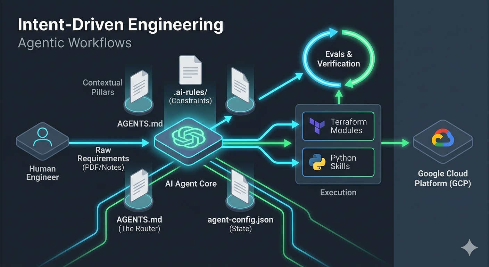

# REPLACE-ME: Main Title

REPLACE-ME: Provide a brief description of the project here.

This repository is built as an **Agentic GCP Infrastructure Template**. It is optimized for **Intent-Driven Engineering** and AI agent orchestration (Antigravity CLI, Cursor, Claude Code, Roo Code). It uses progressive disclosure rules, standard symlinking, and autonomous evaluation loops to prevent LLM hallucinations and enforce strict Google Cloud infrastructure guardrails.

### Architecture

The architecture contains REPLACE-ME.



## 🏗️ Agentic Core Principles & Repository Layout

- **Intent-Driven Engineering:** Developers write constraints, architecture, and tests. Agents write the execution logic (Terraform & Python).
- **Progressive Disclosure:** AI agents are routed to specific rule files in `/.ai-rules/` based on their current task to avoid token bloat and context loss.
- **Agentic Configuration:** Environment variables are managed in `agent-config.json` so agents never guess or hallucinate environment states.
- **`AGENTS.md`**: The global router and primary instruction set for AI agents.
- **`.agents/skills/`**: Custom REST-based agent tools (e.g., interacting with Dataplex/BigQuery).
- **`evals/`**: Executable scripts used by the AI to verify its own code.

---

## 💰 Demo Cost and Usage

* **Idle Cost:** ~$1/day. Minimize by deleting the Colab Runtime and recreating when needed.
* **Notebook Execution:** ~$1 per run for GenAI and BigQuery notebooks. Costs scale with data volume.

**Usage Notes:**
* Notebooks use the latest Gemini models using JSON output. Output may vary with model updates. For production, pin to specific versions.
* Connect to the "colab-enterprise-runtime" within Colab.

---

## 📓 Notebook Deep Dive

Each notebook demonstrates a key aspect of the solution. Explore them below:

| Title | Description | Technology | Video | Link |
|---|---|---|---|---|
| REPLACE-ME | REPLACE-ME | REPLACE-ME | Link | [Template](colab-enterprise/Template.ipynb) |

---

## 🚀 Quick Start (The Agentic Workflow)

If you are using an AI agent (like Antigravity CLI / AGY), do not manually search, replace, or run bash scripts. This template is designed to be set up autonomously.

### 1. Scaffold a New Project
Clone this repository. To rename variables, update directories, and create the required symlinks (`.cursorrules`, `CLAUDE.md`, etc.), feed the scaffolding prompt to your agent.
- Open the Antigravity CLI (AGY) or your agentic IDE.
- Instruct it to run the prompt found in: `@Using-This-Template-Prompt.md`
- *The agent will prompt you for a demo name and execute the entire workspace setup.*

### 2. Deploy the Infrastructure
Deployment is handled securely via wrapper scripts (`deploy.sh`), but you do not need to execute this manually. 
- Tell the agent: *"Run the Terraform deployment."*
- *The agent will execute the bash scripts, provision the GCP environment, and stream the logs.*

### 3. Automatic State Configuration
Based on the rules defined in `.ai-rules/terraform_standards.md`, once the Terraform deployment is successful, the agent will automatically parse `tf-output.json` and update `agent-config.json` with the new environment variables and random suffixes.

---

## 🛠️ Manual Deployment Options

If you are not using an AI agent, or need to configure the environment from scratch, follow these manual deployment options. There are two permission models to deploy the demo depending on your access privileges to your cloud organization.

### Privilege Requirements (2 Options)
1. **Elevated Privileges - Org Level (Preferred)**
   - **Prerequisite:** Billing Account User (to create the project with billing)
   - **Execution:** Run `source deploy.sh`

2. **Owner Project Privileges (Typically Requires Assistance from IT)**
   - **Prerequisite:** You will need a project created for you.
   - **Prerequisite:** You will need to be an Owner (IAM role) of the project.
   - **Execution:** Update the hard-coded values in `deploy-use-existing-project-non-org-admin.sh` and run `source deploy-use-existing-project-non-org-admin.sh`.

### Using your Local machine (Assuming Linux based)
1. Install Git (might already be installed)
2. Install Curl (might already be installed)
3. Install "jq" (might already be installed) - https://jqlang.github.io/jq/download/
4. Install Google Cloud CLI (gcloud) - https://cloud.google.com/sdk/docs/install
5. Install Terraform - https://developer.hashicorp.com/terraform/install
6. Login:
   ```
   gcloud auth login
   gcloud auth application-default login
   ```
7. Type: ```git clone https://github.com/GoogleCloudPlatform/DEMO-NAME```
8. Switch the prompt to the directory: ```cd DEMO-NAME```
9. Run the deployment script
   - If using Elevated Privileges
      - Run ```source deploy.sh```
   - If using Owner Project Privileges
      - Update the hard coded values in ```deploy-use-existing-project-non-org-admin.sh```
      - Run ```source deploy-use-existing-project-non-org-admin.sh```
10. Authorize the login (a popup will appear)
11. Follow the prompts: Answer “Yes” for the Terraform approval.


### To deploy through a Google Cloud Compute VM
1. Create a new Compute VM with a Public IP address or Internet access on a Private IP
   - The default VM is fine (e.g.)
      - EC2 machine is fine for size
      - OS: Debian GNU/Linux 12 (bookworm)
2. SSH into the machine.  You might need to create a firewall rule (it will prompt you with the rule if it times out)   
3. Run these commands on the machine one by one:
   ```
   sudo apt update
   sudo apt upgrade -y
   sudo apt install git
   git config --global user.name "FirstName LastName"
   git config --global user.email "your@email-address.com"
   git clone https://github.com/GoogleCloudPlatform/DEMO-NAME
   cd DEMO-NAME/
   sudo apt-get install apt-transport-https ca-certificates gnupg curl
   sudo apt-get install jq
   gcloud auth login
   gcloud auth application-default login
   sudo apt-get update && sudo apt-get install -y gnupg software-properties-common
   wget -O- https://apt.releases.hashicorp.com/gpg | gpg --dearmor | sudo tee /usr/share/keyrings/hashicorp-archive-keyring.gpg > /dev/null
   gpg --no-default-keyring --keyring /usr/share/keyrings/hashicorp-archive-keyring.gpg --fingerprint
   echo "deb [signed-by=/usr/share/keyrings/hashicorp-archive-keyring.gpg] \
   https://apt.releases.hashicorp.com $(lsb_release -cs) main" | sudo tee /etc/apt/sources.list.d/hashicorp.list
   sudo apt update
   sudo apt-get install terraform

   source deploy.sh 
   # Or 
   # Update the hard coded values in deploy-use-existing-project-non-org-admin.sh
   # Run source deploy-use-existing-project-non-org-admin.sh
   ```
